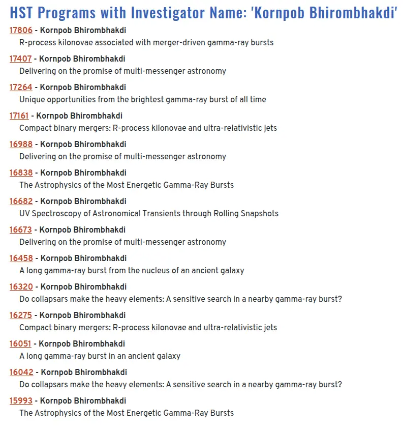
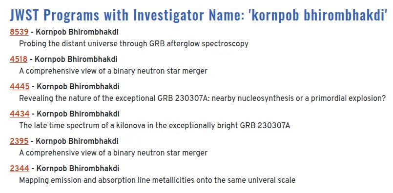
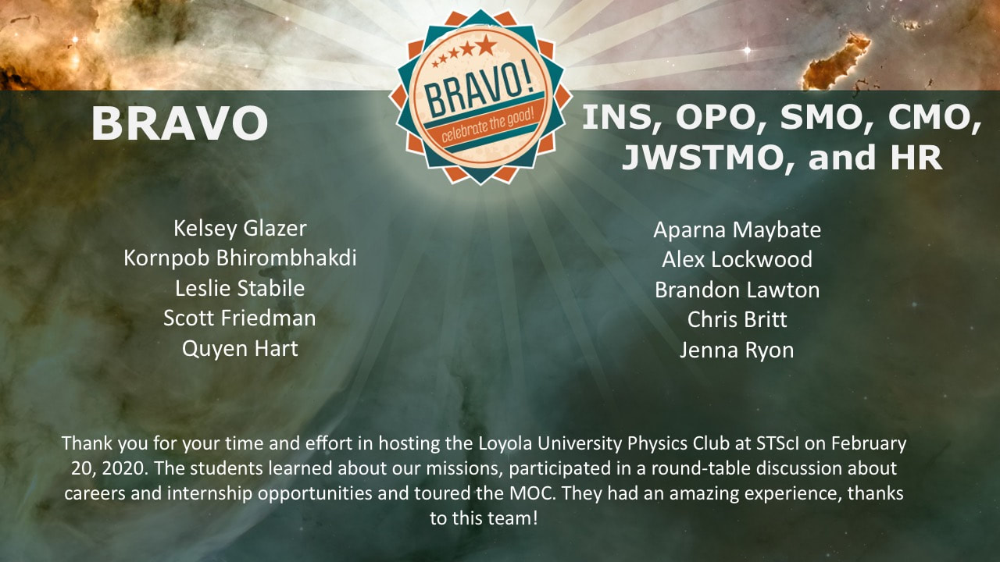
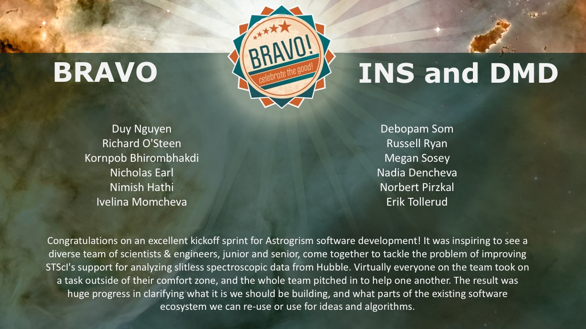

# Achievements

## Judgement Day Phase 1

**Winner, The Judgement Day — Call for Scenario Challenge (Track 1)** (2026)

- **Winning Scenario:** *Counter-UAS System — Friendly Fire Decision (IFF Corruption Attack)* (Scenario S1).
- **Benchmark Suite:** Evaluates multi-sensor correlation failure and friendly fire prevention under operational time pressure.
- **Portfolio Context:** Submit 5 scenarios spanning military autonomous systems, space mission knowledge bases, and software supply chains. [Link](https://github.com/bkornpob/THEJUDGEMENTDAY_PHASE1_REFLECTION)
- **Organizers:** AIM Intelligence and Korea AISI, in collaboration with Google DeepMind, Microsoft, University of Oxford, UIUC, UW, UMass Amherst, and the BASI red-teaming community. [Link](https://judgementday.aim-intelligence.com/arena)

<iframe data-testid="embed-iframe" style="border-radius:12px" src="https://open.spotify.com/embed/episode/0roNa6vKYAAseUISxMw6r9?utm_source=generator&si=12898a300dd94034" width="100%" height="152" frameBorder="0" allowfullscreen="" allow="autoplay; clipboard-write; encrypted-media; fullscreen; picture-in-picture" loading="lazy"></iframe>

## Space Telescope Proposals

HST 14 proposals, JWST 6 proposals

    
    

## ENGRAVE - Electromagnetic counterparts of gravitational wave sources at the Very Large Telescope

_ENGRAVE is a international collaboration bringing together astronomers who use the ESO facilities to research gravitational wave events. It collects over 250 researchers, with both theoretical and observational expertise._ [Link](https://www.engrave-eso.org/)

## Bravo! Awards

issued by the Space Telescope Science Institute (AURA/NASA)

- Hosting the Loyola University Physics Club on February 20, 2020
- Contributing in Astrogrism Sprint during May 12--21, 2020

    
    

## Graduate Awards

2014 -- 2019 — Ohio University, Athens, OH, USA

## Global Game Jam 2017

2017 — as Lead Programmer and Project Coordinator in the project "EchoEcho" with a team at GRID Lab, Ohio University, Athens, OH, USA [(Link to the project)](https://github.com/bkornpob/EchoEcho)

## Kendo 2-Dan

2017 — issued by All United States Kendo Federation, USA (AUSKF ID: 017666)

## Executive Course on Social Security

2012 — as representative from the Faculty of Economics, Chulalongkorn University, organized by the International Labour Organization (UN), in collaboration with Chulalongkorn University, Bangkok, Thailand

## Hands-on Training "How to Cost, Finance and Monitor Social Protection Schemes?"

2012 — as representative from the Faculty of Economics, Chulalongkorn University, organized by the International Labour Organization (UN), in collaboration with Chulalongkorn University and Health Insurance Research Institute of Thailand, Bangkok, Thailand

## The Best Paper Awards

2012 — titled "Cost of Action, Perceived Intention, Positive Reciprocity, and Signalling Model" at The 6th Asian Business Research Conference between 8--10 April 2012, Bangkok, Thailand, organized by the World Academy of Social Science, Victoria, Australia

## Associate Fellowship

2012 — awarded by the World Academy of Social Science, Victoria, Australia

## Research Grants

2012 — The 90th Anniversary of Chulalongkorn University Fund (Ratchadaphiseksomphot Endowment Fund), Chulalongkorn University, Bangkok, Thailand

## Brand Ambassador

2008 — as Playsmart Idol, organized by NC True Co., Ltd., Thailand [(Link to news article)](https://www.online-station.net/pc-console-game/102811/)

## Medical Scholarship Program

2004 -- 2013 — Mahidol University, Bangkok, Thailand

## Gold Medal

2002 — National Physics Olympiad Competition, The Promotion of Academic Olympiads, Thailand

## High Distinction Awards

2001 — from the Australian National Chemistry Quiz in the senior division, organized by the Royal Australian Chemical Institute

## Thailand Representative

2001 — Arirang Youth Camp 5th, UNESCO, South Korea
